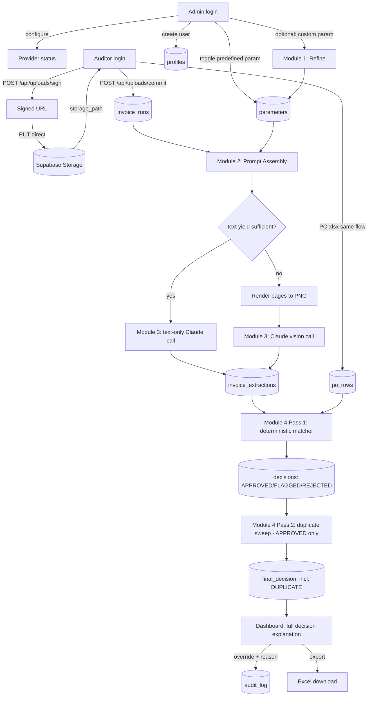
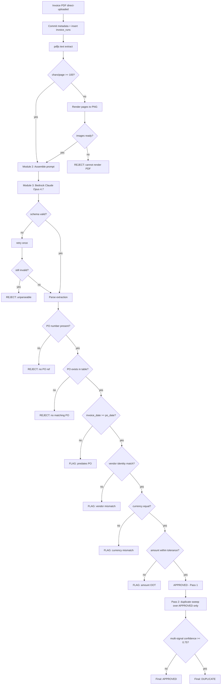

# PRD - Invoice Management Case Study (PS-1)
## Invoice Processing - From PDF to Decision

**Author:** Asmit Dash
**Date:** 2026-08-09
**Version:** 0.2 (Happy path locked. Edge cases to be appended in v0.3 as section 18.)
**Target reader:** A technically fluent engineer with zero prior context on this project.

---

## 0. Product Philosophy

This system is not intended to replace AP judgment in every situation. It automates the repetitive extraction, matching, and deterministic validation work that precedes human approval. The system produces a recommended decision with transparent evidence, while preserving an auditor override and audit trail for ambiguous cases.

The design intentionally separates probabilistic AI work from deterministic business logic. The LLM is responsible for extracting structured information from messy invoices. Deterministic code is responsible for matching, validation, tolerance checks, and decision rules.

That separation is the central architectural principle of this PRD. Every module below is either (a) probabilistic extraction, kept behind a schema-constrained boundary, or (b) deterministic validation, expressed as ordinary code and testable in isolation.

---

## 1. Problem Statement

> **PS-1 - FINANCE / AP**
> **Invoice processing - from PDF to decision**
>
> A mid-size company receives hundreds of vendor invoices every month - all by email, all as PDFs. Someone on the AP team opens each one, finds the matching purchase order in a spreadsheet, checks whether the numbers line up, and decides what to do with it. It's repetitive, it's slow, and it's the kind of work where a tired person on a Friday afternoon makes expensive mistakes.
>
> The invoices themselves are messy. Different vendors format them differently. Some are clean PDFs with machine-readable text. Some are scanned images. Line items might be itemised or bundled. Tax might be embedded or separated. PO references might be explicit or implied. And sometimes critical information is just missing - no invoice number, no date, no clear total.
>
> On the other side is a procurement system with its own logic - approved vendors, PO amounts, tolerance thresholds, duplicate detection rules. Matching an invoice to a PO isn't always obvious. A vendor might split a single PO into multiple invoices. Amounts might be close but not exact. The process has to make a decision - and be able to explain it.
>
> Build a process that takes an invoice as input and produces a clear, reasoned decision as output - with everything that happened in between visible. You decide what to extract, how to validate, what rules matter, and what the output looks like.
>
> **Edge cases - you define them.** Design and build 2-4 edge cases of your own. Realistic scenarios where the process has to behave differently from the happy path.

---

## 2. Problem Statement - Explained

The person the AP team hires to sit in front of an inbox and match invoices to POs does four things every time:

1. **Opens the PDF.** Reads it. Finds the invoice number, the vendor, the date, the total, the line items, the tax, and (crucially) the PO number the invoice claims to be billing against.
2. **Looks up the PO** in whatever system procurement maintains - usually an Excel/CSV export from their ERP - and finds the row whose PO number matches.
3. **Compares the two.** Does the vendor on the invoice match the vendor on the PO? Does the currency match? Does the invoice total fall within tolerance of the PO amount? Is the invoice date after the PO date? Have I already paid an invoice that matches this one on the strong duplicate signals?
4. **Makes a decision.** Approve for payment. Flag for human review because something is off but not fatally so. Reject because something is missing or wrong. And, as a secondary sweep, retag as `DUPLICATE` any invoice that has passed the primary checks but overlaps with another already-approved invoice on the duplicate signals.

Every one of those four steps is either a straight text-extraction problem (step 1) or a straight table-lookup + rule problem (steps 2-4). Neither of those problems needs a human. The reason a human still does them is that step 1 is fragile - invoices are unstructured PDFs, sometimes scanned, sometimes hand-written - and steps 2-4 need enough context that a rule engine alone cannot make the call without human judgment on the ambiguous cases.

The system built in this PRD replaces the human on steps 1-3 entirely (LLM extraction + deterministic matching), keeps a human in the loop for step 4 (auditors can override decisions with a reason), and produces an auditable trail of every decision the system made and why.

Two additional constraints came out of internal design:

- **Multi-tenant configurability.** The set of fields the system extracts from an invoice is not fixed by code. An admin defines the extraction schema at runtime. v0.1 seeds a full predefined schema that covers the happy path (see section 5.1). The optional custom-parameter refinement is extensibility only; it is not required for normal invoice processing.
- **Model swappability at the boundary.** The extraction layer is not tightly coupled to one vendor. Provider abstraction is retained at the application boundary. However, v0.1 only needs a production-ready implementation for AWS Bedrock + Claude Opus 4.7. Additional providers (OpenAI, Anthropic direct, Gemini, OpenRouter) are future extensibility and are not required for the demo.

---

## 3. Personas

| Role | Count | Capabilities |
|---|---|---|
| **Admin** | 1 (bootstrap) | Manage auditors (add/remove). View / configure the active provider + model + connection status. Toggle predefined extraction parameters on/off. (Optionally) add custom parameters through the extensibility flow. Everything an auditor can do. |
| **Auditor** | Many | Upload PO spreadsheet. Upload invoice PDFs (single or batch). View live-run progress. View dashboard with full decision explanations. Open the original invoice PDF. Override a decision with a mandatory reason. Export the final Excel report. |

There is exactly one admin account seeded on first boot. The admin creates all auditors. In practice the admin will also act as an auditor - the two roles are additive, not exclusive.

---

## 4. Tech Stack (locked)

Every choice is justified in one sentence. If you are the reader who "knows nothing about the project," this table is your map.

| Layer | Choice | Why this and not something else |
|---|---|---|
| **Frontend framework** | Next.js 15 (App Router) + React 19 + TypeScript | Server actions collapse the frontend/backend boundary; App Router streaming lets us render the live-run view without wiring a WebSocket. |
| **Styling** | Tailwind CSS + shadcn/ui | Fastest way to a polished, unobtrusive UI. `shadcn` gives us tables, dialogs, toasts, form primitives out of the box. |
| **Auth** | Supabase Auth (email + password) with a `role` claim in the JWT | Reuses the same Supabase project as the DB and Storage; the `role` claim gates admin vs auditor routes. |
| **Structured DB** | Supabase Postgres | Stores users (via `auth.users` + a `profiles` table), parameters, runs, extractions, decisions, PO rows, audit log. |
| **File storage** | Supabase Storage (bucket `invoices`, bucket `po-sheets`) | Raw PDFs and Excel files live in object storage, not Postgres. |
| **Upload transport** | **Direct browser -> Supabase Storage using signed upload URLs.** Vercel only issues the token and receives the resulting `storage_path` afterward. | Large files must not pass through Vercel serverless request bodies. |
| **App host** | Vercel (serverless routes + edge middleware) | Zero infra. One `vercel --prod` and it is live. |
| **ORM (Postgres)** | Drizzle ORM | Type-safe, close to SQL, migrations are readable diffs. |
| **LLM SDK layer** | Vercel AI SDK with `@ai-sdk/amazon-bedrock` as the concrete adapter for v0.1 | The AI SDK gives a single API surface (`generateObject`) with structured-output enforcement. Additional adapters can be swapped in later without touching the extraction module. |
| **Default provider + model** | **AWS Bedrock hosting Claude Opus 4.7** | Best vision + reasoning combo for messy PDFs; keeps invoice content inside an enterprise-boundary environment. |
| **PDF handling** | `pdfjs-dist` for text extraction; `pdf-to-png-converter` for scanned invoices; pass image bytes to Claude vision | Two-track: text-first (cheap, fast); vision only when text yield is below a threshold. |
| **Spreadsheet parsing** | `xlsx` (SheetJS) for `.xlsx`, `.xls`, `.csv` | Ubiquitous, zero-dependency, handles every format an AP team will hand us. |
| **Excel export** | `exceljs` | Richer than `xlsx` for writing formatted output (headers, colours per decision bucket). |
| **Live-run UI transport** | Server-Sent Events (SSE) via a Next.js Route Handler | Simpler than WebSockets, native browser support, one-way (server -> client). |
| **Local dev** | `pnpm dev` + Supabase local CLI + Vercel CLI for env pull | Standard. |
| **Testing (light)** | `vitest` for the deterministic matcher; a smoke E2E for the happy-path upload flow | The matcher is the deterministic core; that gets unit tests. Everything else is exercised by the demo. |

If Bedrock quota is unavailable on the day of the demo, the provider adapter can be swapped for `@ai-sdk/anthropic` (Anthropic direct) with a single env change; the extraction module code does not change.

---

## 5. The Four Modules (happy path, in execution order)

The system is four modules plus a thin auth/UI shell around them. Each module has explicit inputs, outputs, and side effects. No assumed shared state - everything crosses module boundaries through Postgres rows.

### 5.1 Module 1 - Parameter Refinement (extensibility only, admin-only)

**Purpose.** Convert an admin's free-text description of a new parameter into a structured JSON object that the extraction prompt can consume.

**Scope in v0.1.** The system ships with a predefined, active extraction schema. Normal invoice processing uses that schema and never invokes this module. This module exists so a future admin can add domain-specific fields without a code change. **Custom parameter refinement is an extensibility capability and is not required for normal invoice processing in v0.1.** If build time gets tight, this module can be deferred to v0.2 without any impact on the rest of the pipeline; the DB schema is already set up to accept new rows.

**Seed schema (all `active = true` by default):**

- `invoice_number`
- `invoice_date`
- `vendor_name`
- `vendor_id`
- `po_number`
- `invoice_total`
- `currency`
- `tax`
- `line_items`

**When it runs.** Only when the admin clicks "+ Add parameter" in the Admin -> Parameters page and chooses "custom" instead of picking from the predefined set. It does not run on every invoice.

**Inputs.**
- `raw_description: string` - what the admin typed. Example: *"Check the GST is a 15-character alphanumeric code that starts with a 2-digit Indian state code."*
- `raw_name: string` - what the admin called the parameter. Example: *"gst_number"*.

**Processing.**
1. Frontend generates a 3-digit random unique ID (e.g. `487`) and calls the server action `refineParameter({raw_name, raw_description})`.
2. Server action makes one call to Claude Opus 4.7 (via Bedrock) with a system prompt: *"You are a schema designer. Given a raw parameter definition, return JSON with these fields: `id` (echo), `name` (snake_case), `display_name` (Title Case), `type` (one of: string, number, date, currency, regex_match, boolean), `format_hint` (short instruction appended to the extraction prompt), `required` (true/false, infer from wording), `example`."*
3. LLM returns structured JSON. Server action validates against a Zod schema; retries once on validation failure.
4. Result inserted into Postgres `parameters` with `active = true`.

**Outputs.**
- One new row in `parameters`.
- Response back to the admin UI showing the parsed structure so they can review and toggle `active`.

**Side effects.** None outside the DB write.

**Cost profile.** ~1 LLM call per new parameter added. Zero cost during normal invoice processing.

---

### 5.2 Module 2 - Prompt Assembly (per-run, cheap)

**Purpose.** Read the currently-active parameters from Postgres and build the exact extraction prompt that Module 3 will send to the LLM.

**When it runs.** At the very start of every invoice run, immediately before Module 3.

**Inputs.**
- Read from Postgres: `SELECT * FROM parameters WHERE active = true ORDER BY id`.
- The invoice PDF (streamed from Supabase Storage using its `storage_path`).

**Processing.**
1. Query active parameters.
2. Build the JSON schema fragment that the LLM will be asked to fill in. Each active parameter contributes one field with its `name`, `type`, `format_hint`, and `required` status.
3. Assemble a two-part prompt:
   - **System prompt** (static): *"You are an AP clerk. Extract the specified fields from the attached invoice. Return only valid JSON matching the given schema. For any field not present in the invoice, return null (do not guess). Extract line items into a `line_items` array; also return `line_items_raw` as the verbatim string from the invoice. Line items are being captured for auditability and future reconciliation; they are not used to make the primary decision in v0.1."*
   - **User prompt** (dynamic): the JSON schema fragment + the invoice as either extracted text or page images.
4. Return the prompt object to Module 3.

**Outputs.** A prompt object: `{ system, user, images?, schema }`.

**Side effects.** None. Pure function of DB state + input PDF.

**Cost profile.** Zero LLM calls. Sub-millisecond DB query.

---

### 5.3 Module 3 - LLM Extraction Layer (per-run, expensive)

**Purpose.** Call Claude Opus 4.7 via Bedrock with the prompt from Module 2 and get back a structured JSON extraction of the invoice.

**When it runs.** Once per invoice upload. Batch uploads of N invoices run N times, queued at concurrency 4 to respect provider rate limits.

**Text-first extraction, vision fallback.**

```
PDF text extraction first
        |
        v
Is sufficient text available?
     /       \
   YES        NO
    |          |
    |       render pages
    |          |
    |       Claude vision
     \        /
       Claude
         |
   structured JSON
```

**Why:** *"Text-first extraction reduces unnecessary vision calls and therefore reduces latency and model cost. Vision is used when the PDF is scanned or does not yield sufficient machine-readable text."*

**Processing.**
1. **Text extraction attempt (free).** Run `pdfjs-dist` on the PDF. Sum the character count. If characters/page < 100, treat as scanned. Else use extracted text as the user-prompt payload. Set `invoice_runs.extraction_mode = 'text'`.
2. **Vision attempt (if scanned).** Render each page to a 200-DPI PNG using `pdf-to-png-converter`. Attach as image parts in the prompt. Set `invoice_runs.extraction_mode = 'vision'`.
3. **Provider dispatch.** `generateObject({ model: bedrockAdapter('claude-opus-4-7'), schema, system, prompt })`. This forces the LLM to return JSON matching the Zod schema built by Module 2.
4. **Retry policy.** On schema-validation failure, retry once with the parse error appended. On rate-limit or 5xx, exponential backoff, up to 3 retries. On terminal failure, mark the run `status = 'extraction_failed'` and emit a REJECT decision with reason `unparseable extraction`.
5. **Persist.** Insert the extraction into `invoice_extractions` linked to the parent `invoice_runs` row.
6. **Stream progress.** Emit SSE events at each stage boundary (`text_extracted`, `vision_started`, `llm_called`, `llm_returned`, `persisted`).

**Outputs.**
- One row in `invoice_extractions` containing the structured JSON + `line_items_raw` + `line_items` + provider/model used + tokens + latency + raw response.
- SSE progress events consumed by the live-run view.

**Side effects.** The invoice PDF was already in Supabase Storage before this module ran (see section 6). This module only reads it.

**Cost profile.** 1 LLM call per invoice. Roughly $0.02-0.05 per invoice with Opus 4.7 vision.

**Line items - scope in v0.1.** Line items are extracted and stored (structured + raw string) for auditability, transparency, and future reconciliation. **Full line-item-level reconciliation is intentionally outside v0.1 scope.** The system extracts line items because they are valuable evidence for auditors and provide a foundation for future two-way or three-way matching. The v0.1 automated decision engine operates on: PO existence, invoice/PO date relationship, vendor identity, currency, invoice total vs PO amount, and duplicate detection.

---

### 5.4 Module 4 - Matching + Decision (two-pass, deterministic)

**Purpose.** Compare the extracted invoice data against the PO spreadsheet and produce a decision. A second pass runs a duplicate sweep across the current cycle of `APPROVED` invoices.

**When it runs.** Pass 1 runs immediately after Module 3 for each invoice. Pass 2 runs (a) whenever a new PO spreadsheet is uploaded, and (b) at the end of a batch invoice run.

**Inputs.**
- Extraction JSON from Module 3.
- Latest PO table, parsed to `po_rows` (Postgres). Columns include `po_number`, `po_date`, `vendor_name`, `vendor_id`, `po_amount`, `currency`, `line_item_summary`.
- Global settings: `tolerance_pct` (default 2.0), `vendor_match_threshold` (default 0.85).

#### Pass 1 - Per-invoice decision (three outcomes only)

Pass 1 has **exactly three outcomes**: `APPROVED`, `FLAGGED_FOR_REVIEW`, `REJECTED`. `DUPLICATE` is never produced by Pass 1.

Execution order:

1. **Extraction success check.** If the run reached this module with `status = 'extraction_failed'`, decision = `REJECTED`, reason = `unparseable extraction`.
2. **PO number present.** If `extraction.po_number` is null/empty, decision = `REJECTED`, reason = `no PO reference on invoice`.
3. **PO exists in table.** Join key = `po_number`. If no matching row, decision = `REJECTED`, reason = `no matching PO`.
4. **Date order check.** If `invoice_date < po_date`, decision = `FLAGGED_FOR_REVIEW`, reason = `invoice predates PO`.
5. **Vendor identity check.** Prefer exact `vendor_id` match. Fall back to fuzzy `vendor_name` match (Levenshtein ratio >= 0.85). Mismatch: decision = `FLAGGED_FOR_REVIEW`, reason = `vendor mismatch: <invoice> vs <po>`.
6. **Currency check.** If `invoice.currency != po.currency`, decision = `FLAGGED_FOR_REVIEW`, reason = `currency mismatch: invoice <X> vs PO <Y>`. **No FX conversion is performed in v0.1.**
7. **Amount tolerance check.** If `abs(invoice_total - po_amount) / po_amount > tolerance_pct/100`, decision = `FLAGGED_FOR_REVIEW`, reason = `amount outside tolerance: <X> vs <Y> (<delta>% delta)`.
8. **All checks pass.** Decision = `APPROVED`.

Hard failures (unparseable extraction, no PO ref on invoice, no matching PO in table) produce `REJECTED`. Suspicious but potentially legitimate mismatches (date order, vendor identity, currency, amount tolerance) produce `FLAGGED_FOR_REVIEW`.

Row is written to `decisions` with all the check results as columns so the audit view can show which check failed.

#### Pass 2 - Duplicate sweep (only over APPROVED)

*"Duplicate is a post-processing classification applied only to invoices that have successfully passed the primary invoice/PO validation checks."*

Pass 2 only touches invoices where `pass1_decision = 'APPROVED'`. Nothing in `FLAGGED_FOR_REVIEW` or `REJECTED` is considered.

**Duplicate signals.** *"PO number and invoice date alone are insufficient to establish a duplicate because legitimate invoices may share a PO and date. Duplicate detection therefore uses invoice number, vendor identity, amount, PO reference, and date as combined evidence."*

For each `APPROVED` invoice, compute a **duplicate confidence score** against every other `APPROVED` invoice in the current cycle:

| Signal | Weight | Match condition |
|---|---:|---|
| Same invoice_number | 0.40 | exact, case-insensitive, whitespace-trimmed |
| Same vendor (id preferred, else fuzzy name >= 0.90) | 0.20 | strict vendor identity |
| Same invoice_total (within 0.5%) | 0.20 | near-exact amount |
| Same po_number | 0.10 | exact |
| Same invoice_date | 0.05 | exact |
| Same currency | 0.05 | exact |

If the summed confidence is `>= 0.75`, the pair is a duplicate. Both members get retagged `DUPLICATE` and the `duplicate_of` field on the *later* row points at the *earlier* row (by `uploaded_at`). If a group of three or more matches at that threshold pairwise, all members link back to the earliest.

Pass 2 emits SSE `pass2_complete` with counts of retagged rows.

**Outputs.**
- One row in `decisions` per invoice with: `run_id`, `pass1_decision`, `final_decision`, `reason`, `matched_po_id`, `amount_delta`, `date_delta_days`, `vendor_match_score`, `currency_ok`, `duplicate_of`, `duplicate_confidence`.

**Cost profile.** Zero LLM calls. Sub-second per invoice for a PO table of a few thousand rows.

---

## 6. File Upload Architecture (direct browser -> Supabase Storage)

*"Structured metadata, extracted invoice data, PO data, decisions, and audit records belong in relational storage. Raw PDFs belong in object storage. Separating these concerns avoids storing binary blobs in Postgres while also avoiding unnecessary infrastructure. Direct browser-to-object-storage uploads prevent large files from passing through the Vercel application layer."*

Every file upload (invoice PDFs and PO spreadsheets) follows the same pattern:

```
Browser
  |
  | 1. request signed upload permission (POST /api/uploads/sign)
  v
Vercel server route
  |
  | 2. verify session + role, return secure upload URL/token
  v
Browser
  |
  | 3. direct upload (PUT to Supabase Storage signed URL)
  v
Supabase Storage
  |
  | 4. return storage path/key
  v
Browser
  |
  | 5. submit metadata + storage_path (POST /api/uploads/commit)
  v
Vercel server route
  |
  | 6. insert row (invoice_runs or po_rows batch) + kick off pipeline
  v
invoice_runs + processing pipeline
```

**The Vercel serverless functions never receive the file bytes.** They receive only signed-URL requests and lightweight metadata (`storage_path`, `filename`, `file_size_bytes`, `content_type`, `uploaded_by`).

This applies to both:

- Invoice PDFs -> bucket `invoices`, path pattern `runs/{run_id}.pdf`.
- PO spreadsheets -> bucket `po-sheets`, path pattern `sheets/{upload_id}.xlsx`.

Access control: both buckets are private. All downloads (invoice viewer popup, PO re-download) use short-lived signed read URLs generated on demand by a Vercel route after checking the user session.

---

## 7. Data Flow Diagram (user-facing)

### 7.1 ASCII

```
[Admin]                                                     [Auditor]
   |                                                            |
   | (first login: bootstrap)                                   | (day-to-day)
   |                                                            |
   +--> configure provider status ------> providers table       |
   |                                                            |
   +--> toggle predefined parameter ---> parameters table       |
   |                                                            |
   +--> (optional) add custom param ---> Module 1 -----+        |
   |                                                    v       |
   |                                             parameters table
   |                                                            |
   +--> add/remove auditor --------------> profiles table       |
                                                                |
                                                                +--> request signed URL
                                                                |         (Vercel route)
                                                                v
                                                     +--- direct upload --> Supabase Storage
                                                     |    (invoice PDF or PO xlsx)
                                                     |
                                                     v
                                            commit metadata (Vercel route)
                                                     |
                                                     v
                                                invoice_runs / po_rows batch inserted
                                                     |
                                                     v
                                              [ Module 2: Prompt Assembly ]
                                                     |
                                                     v (read active params)
                                              [ Module 3: LLM Extraction ]
                                                     |         |
                                                text yield >= threshold?
                                                     |         |
                                              text-only <-yes  no-> render pages -> Claude vision
                                                     v         v
                                              [ Claude Opus 4.7 via AWS Bedrock ]
                                                              |
                                                              v
                                                      extraction JSON
                                                              |
                                                              v
                                              [ Module 4 Pass 1: deterministic matcher ]
                                                              |
                                                              v
                                            decision in {APPROVED, FLAGGED_FOR_REVIEW, REJECTED}
                                                              |
                                                              v
                                              [ Module 4 Pass 2: duplicate sweep (only over APPROVED) ]
                                                              |
                                                              v (multi-signal confidence)
                                                    retag confirmed duplicates -> DUPLICATE
                                                              |
                                                              v
                                                       dashboard row
                                                              |
                                                              v
                                         +----- auditor override + mandatory reason ----+
                                         |                                              |
                                         v                                              v
                                    audit_log row                              updated final decision
                                                                                        |
                                                                                        v
                                                                             export to Excel
```

### 7.2 Tabular

| Step | Actor | Input | Module | Output | Persistence |
|---:|---|---|---|---|---|
| 1 | Admin | credentials | Supabase Auth | session (JWT with role claim) | `auth.users` |
| 2 | Admin | active provider + model status | Admin UI | provider config | `providers` |
| 3 | Admin | toggle predefined param | Admin UI | active/inactive flag | `parameters` |
| 4 | Admin (optional) | custom param free-text | Module 1 | refined JSON parameter | `parameters` |
| 5 | Admin | auditor email + password | Admin UI | new auditor account | `auth.users`, `profiles` |
| 6 | Auditor | signed-URL request | `/api/uploads/sign` | signed PUT URL | none |
| 7 | Auditor | file bytes | (direct to Supabase) | `storage_path` | Supabase Storage |
| 8 | Auditor | storage_path + metadata | `/api/uploads/commit` | run_id (invoice) or batch_id (PO) | `invoice_runs` / `po_rows` |
| 9 | System | run_id | Module 2 | prompt object | (in-memory) |
| 10 | System | prompt object + PDF | Module 3 | extraction JSON | `invoice_extractions` |
| 11 | System | extraction + PO table | Module 4 (Pass 1) | decision row | `decisions` (pass1_decision) |
| 12 | System | approved rows | Module 4 (Pass 2) | duplicate retags | `decisions` (final_decision) |
| 13 | Auditor | tag override + mandatory reason | Dashboard | new final decision + audit entry | `decisions`, `audit_log` |
| 14 | Auditor | export click | Export handler | xlsx file | (streamed to browser) |

### 7.3 Mermaid



---

## 8. Backend Logic Diagram (with fallbacks)

The data-flow diagram in section 7 shows the happy path. This section shows every decision point and what happens on each branch.

### 8.1 ASCII

```
[invoice PDF received via direct browser upload]
        |
        v
  commit metadata -> insert invoice_runs (status=received)
        |
        v
+---> pdfjs-dist text extract
|       |
|       v
|  chars/page >= 100?
|       |
|   +---+---+
|   |       |
|  yes     no
|   |       |
|   |       v
|   |   render pages to 200-DPI PNG
|   |       |
|   |       v
|   |   images ready?
|   |       |
|   |   +---+---+
|   |   |       |
|   |  yes     no ---> status=extraction_failed
|   |   |               decision=REJECTED
|   |   |               reason=cannot render PDF
|   v   v
|  build prompt (Module 2)
|       |
|       v
|  call Claude Opus 4.7 via Bedrock (Module 3)
|       |
|       v
|  response valid against schema?
|       |
|   +---+---+
|   |       |
|  yes     no ---> retry once with error appended
|   |               |
|   |          still invalid? ---> status=extraction_failed
|   |                              decision=REJECTED
|   |                              reason=unparseable extraction
|   v
|  parse extraction JSON -> invoice_extractions
|       |
|       v
|  PO number present in extraction?
|       |
|   +---+---+
|   |       |
|  yes     no ---> decision=REJECTED
|   |               reason=no PO reference on invoice
|   v
|  match po_number in po_rows
|       |
|       v
|  found?
|       |
|   +---+---+
|   |       |
|  yes     no ---> decision=REJECTED
|   |               reason=no matching PO
|   v
|  invoice_date >= po_date?
|       |
|   +---+---+
|   |       |
|  yes     no ---> decision=FLAGGED_FOR_REVIEW
|   |               reason=invoice predates PO
|   v
|  vendor identity match?  (exact vendor_id preferred; fuzzy name >= 0.85 fallback)
|       |
|   +---+---+
|   |       |
|  yes     no ---> decision=FLAGGED_FOR_REVIEW
|   |               reason=vendor mismatch: X vs Y
|   v
|  invoice.currency == po.currency?
|       |
|   +---+---+
|   |       |
|  yes     no ---> decision=FLAGGED_FOR_REVIEW
|   |               reason=currency mismatch: invoice USD vs PO INR
|   v
|  |invoice_total - po_amount| / po_amount <= tolerance?
|       |
|   +---+---+
|   |       |
|  yes     no ---> decision=FLAGGED_FOR_REVIEW
|   |               reason=amount outside tolerance: X vs Y (delta%)
|   v
|  pass1_decision=APPROVED
|       |
+-------|
        v
   Pass 2 (runs over all APPROVED at end of batch / on new PO upload)
        |
        v
   for each pair of APPROVED invoices, compute duplicate confidence
   using invoice_number + vendor + total + po + date + currency
        |
        v
   confidence >= 0.75?
        |
    +---+---+
    |       |
   yes     no ---> keep APPROVED as final_decision
    |
    v
   retag both as DUPLICATE
   set duplicate_of = earliest run
        |
        v
   dashboard row visible to auditor with full decision explanation
        |
        v
   auditor may override -> writes to audit_log with mandatory reason
```

### 8.2 Tabular (decision matrix)

| Check | Pass condition | Fail action | Fail reason string |
|---|---|---|---|
| PDF renderable | text OR image extraction succeeds | short-circuit REJECT | `cannot render PDF` |
| LLM parses to schema | valid JSON matching Zod schema after 1 retry | short-circuit REJECT | `unparseable extraction` |
| PO number present | `po_number != null` | REJECT | `no PO reference on invoice` |
| PO exists in spreadsheet | join hit on `po_number` | REJECT | `no matching PO` |
| Date order | `invoice_date >= po_date` | FLAG | `invoice predates PO` |
| Vendor identity | exact `vendor_id` match or fuzzy `vendor_name` >= 0.85 | FLAG | `vendor mismatch: X vs Y` |
| Currency | `invoice.currency == po.currency` | FLAG | `currency mismatch: invoice X vs PO Y` |
| Amount tolerance | delta / po_amount <= tolerance (default 2%) | FLAG | `amount outside tolerance: X vs Y (D% delta)` |
| Duplicate sweep (Pass 2) | multi-signal confidence < 0.75 | retag APPROVED -> DUPLICATE | `duplicate of run_id=N (confidence=0.87)` |

### 8.3 Mermaid



---

## 9. Database Schema (Postgres, via Supabase)

```sql
-- Users: Supabase Auth provides auth.users. We layer a profile with role.
CREATE TABLE profiles (
  id           uuid PRIMARY KEY REFERENCES auth.users(id) ON DELETE CASCADE,
  email        text UNIQUE NOT NULL,
  role         text NOT NULL CHECK (role IN ('admin','auditor')),
  created_at   timestamptz DEFAULT now(),
  created_by   uuid REFERENCES profiles(id)
);

-- LLM providers - v0.1 only uses one row (Bedrock + Claude Opus 4.7)
CREATE TABLE providers (
  id           uuid PRIMARY KEY DEFAULT gen_random_uuid(),
  provider     text NOT NULL CHECK (provider IN ('bedrock','anthropic','openai','gemini','openrouter')),
  model_id     text NOT NULL,
  region       text,                    -- for bedrock
  is_active    boolean DEFAULT false,   -- exactly one row is active at a time
  connection_ok boolean,                -- last-known health
  last_checked timestamptz,
  created_at   timestamptz DEFAULT now()
);

-- Extraction parameters (seeded with 9 predefined; custom rows appended by Module 1)
CREATE TABLE parameters (
  id           text PRIMARY KEY,        -- 3-digit code (custom) OR predefined slug
  name         text UNIQUE NOT NULL,    -- snake_case
  display_name text NOT NULL,
  type         text NOT NULL,           -- string|number|date|currency|regex_match|boolean
  format_hint  text,                    -- injected into prompt
  required     boolean DEFAULT false,
  active       boolean DEFAULT true,
  is_predefined boolean DEFAULT false,
  created_at   timestamptz DEFAULT now()
);

-- Global settings
CREATE TABLE settings (
  key   text PRIMARY KEY,
  value jsonb NOT NULL
);
-- seeded: ('tolerance_pct', '2.0'),
--         ('vendor_match_threshold', '0.85'),
--         ('duplicate_confidence_threshold', '0.75')

-- PO spreadsheet rows
CREATE TABLE po_rows (
  id                uuid PRIMARY KEY DEFAULT gen_random_uuid(),
  po_number         text NOT NULL,
  po_date           date NOT NULL,
  vendor_name       text NOT NULL,
  vendor_id         text,
  po_amount         numeric(14,2) NOT NULL,
  currency          text DEFAULT 'INR',
  line_item_summary text,
  uploaded_by       uuid REFERENCES profiles(id),
  uploaded_at       timestamptz DEFAULT now()
);
CREATE INDEX ON po_rows (po_number);

-- Invoice runs - one per uploaded PDF
CREATE TABLE invoice_runs (
  id               uuid PRIMARY KEY DEFAULT gen_random_uuid(),
  filename         text NOT NULL,
  storage_path     text NOT NULL,        -- e.g. runs/<uuid>.pdf inside the 'invoices' bucket
  file_size_bytes  bigint,
  uploaded_by      uuid REFERENCES profiles(id),
  uploaded_at      timestamptz DEFAULT now(),
  status           text NOT NULL DEFAULT 'received',
                                        -- received | extracting | matched | failed
  extraction_mode  text                 -- text | vision
);

-- Extraction result
CREATE TABLE invoice_extractions (
  run_id         uuid PRIMARY KEY REFERENCES invoice_runs(id) ON DELETE CASCADE,
  extracted_json jsonb NOT NULL,        -- all active param fields
  line_items_raw text,                  -- verbatim string, audit only
  line_items     jsonb,                 -- parsed, audit only in v0.1
  provider_used  text,                  -- 'bedrock' in v0.1
  model_used     text,                  -- 'claude-opus-4-7'
  tokens_in      integer,
  tokens_out     integer,
  latency_ms     integer,
  raw_response   text,
  created_at     timestamptz DEFAULT now()
);

-- Decisions (both passes stored)
CREATE TABLE decisions (
  run_id                uuid PRIMARY KEY REFERENCES invoice_runs(id) ON DELETE CASCADE,
  pass1_decision        text NOT NULL CHECK (pass1_decision IN ('APPROVED','FLAGGED_FOR_REVIEW','REJECTED')),
  final_decision        text NOT NULL CHECK (final_decision IN ('APPROVED','FLAGGED_FOR_REVIEW','REJECTED','DUPLICATE')),
  reason                text,
  matched_po_id         uuid REFERENCES po_rows(id),
  amount_delta          numeric(14,2),
  amount_delta_pct      numeric(6,3),
  date_delta_days       integer,
  vendor_match_score    numeric(4,3),
  currency_ok           boolean,
  duplicate_of          uuid REFERENCES invoice_runs(id),
  duplicate_confidence  numeric(4,3),
  decided_at            timestamptz DEFAULT now()
);

-- Override audit trail
CREATE TABLE audit_log (
  id            uuid PRIMARY KEY DEFAULT gen_random_uuid(),
  run_id        uuid REFERENCES invoice_runs(id),
  actor         uuid REFERENCES profiles(id),
  from_decision text,
  to_decision   text,
  reason        text NOT NULL,           -- mandatory
  at            timestamptz DEFAULT now()
);
```

Supabase Storage buckets (both private, signed URLs only):

- `invoices` - path pattern `runs/{run_id}.pdf`
- `po-sheets` - path pattern `sheets/{upload_id}.xlsx`

---

## 10. UI Surface

Three routes, all authenticated.

- **`/login`** - Supabase Auth (email + password).
- **`/admin`** - visible to `role=admin` only. Three tabs:
  1. **Users** - list, add, remove auditors.
  2. **Model** - shows the active provider (`bedrock`), the active model (`claude-opus-4-7`), and the last-known connection status. This is intentionally small: **the important architectural point is model swappability at the boundary, not demonstrating five providers.**
  3. **Parameters** - table of parameters with toggle switches. The 9 predefined parameters are seeded active. `+ Add parameter` opens a dialog for the optional extensibility flow that calls Module 1.
- **`/dashboard`** - visible to both roles. Two panes:
  1. **Runs table** - filename (hyperlink opens invoice PDF via signed URL in a popup), uploaded-at, final decision chip, reason, PO#, currency, amount delta, vendor match score, override button.
  2. **Live-run drawer** - opens automatically when an upload is in progress. Shows the pipeline as a vertical list of stages with status chips (`pending`, `running`, `done`, `failed`) updated via SSE.
- **`/dashboard/upload`** - dropzone accepting one or many invoice PDFs, plus a separate xlsx dropzone for the PO spreadsheet. Both use the direct-to-Supabase-Storage flow described in section 6.
- **`/dashboard/export`** - streams an .xlsx (built with exceljs), colour-coded by decision bucket.

**Live-run UI stages, in the order the auditor sees them:**

```
Upload
  ↓
File validation
  ↓
Text extraction  /  Vision fallback
  ↓
LLM extraction (Bedrock Claude Opus 4.7)
  ↓
PO matching
  ↓
Date check
  ↓
Vendor check
  ↓
Currency check
  ↓
Amount / tolerance check
  ↓
Pass 1 decision
  ↓
Duplicate sweep
  ↓
Final decision
```

---

## 11. Audit Trail (what is preserved per run)

Every invoice run preserves, and the dashboard exposes:

- Original file reference (signed URL to Supabase Storage)
- Extraction mode (text or vision)
- Model/provider used (`bedrock` / `claude-opus-4-7`)
- Extracted fields (the full `extracted_json`)
- Line items (structured + raw string, audit only in v0.1)
- Matched PO (or the fact that none was matched)
- Individual validation results (PO found, date order, vendor, currency, tolerance)
- Amount delta (absolute and %)
- Vendor match score
- Currency comparison outcome
- Pass 1 decision
- Duplicate detection result (confidence + link to duplicate_of, if any)
- Final decision
- Auditor override, if any (before/after values, reason, actor, timestamp)
- Timestamps for every stage

---

## 12. Decision Explanation Model

Do not only display the label. Every decision surfaces a structured, human-readable explanation derived from the deterministic checks.

### APPROVED

```
Decision: APPROVED

Checks:
- PO found: PASS
- Vendor: PASS
- Currency: PASS
- Invoice date: PASS
- Amount tolerance: PASS (1.2% delta)
- Duplicate sweep: PASS

Reason:
"Invoice INV-0001 matches PO-1001. Vendor identity and currency match,
 invoice date is valid, and total is within the configured 2% tolerance."
```

### FLAGGED_FOR_REVIEW

```
Decision: FLAGGED_FOR_REVIEW

Checks:
- PO found: PASS
- Vendor: PASS
- Currency: PASS
- Invoice date: PASS
- Amount tolerance: FAIL (5.4% delta, threshold 2.0%)
- Duplicate sweep: N/A

Reason:
"Invoice total is 5.4% above PO amount, exceeding the configured 2% tolerance.
 All other checks passed."
```

### REJECTED

```
Decision: REJECTED

Checks:
- PO found: FAIL

Reason:
"No matching PO was found for PO-9999."
```

### DUPLICATE (Pass 2 outcome)

```
Decision: DUPLICATE

Pass 1: APPROVED
Duplicate sweep: FAIL (confidence 0.87)
- Same invoice_number: YES
- Same vendor: YES
- Same total (within 0.5%): YES
- Same PO: YES
- Same date: NO

Reason:
"This invoice matches an earlier APPROVED invoice (run_id=abc123)
 on invoice number, vendor, total, and PO reference. Confidence 0.87
 exceeds the 0.75 duplicate threshold."
```

This satisfies the brief's explicit requirement: *"produces a clear, reasoned decision as output - with everything that happened in between visible."*

---

## 13. Demo Reliability and Operational Safeguards

The interviewer must be able to upload a known invoice and see a deterministic, repeatable outcome. This section lists the safeguards baked in for that.

- **Seeded sample PO dataset.** `po_master.xlsx` shipped alongside the 20 sample invoices. Pre-uploaded before every demo.
- **Seeded happy-path invoice set.** 20 invoices with intentionally varied formatting (section 15). All 20 resolve to `APPROVED` on the happy path.
- **Deterministic matcher tests.** `vitest` suite over Module 4. Test fixtures cover every branch of the decision tree in section 8.2. These run in CI on every push.
- **Clear processing status.** The `invoice_runs.status` column advances through `received -> extracting -> matched | failed`. The live-run drawer mirrors this via SSE.
- **Retry for transient LLM failures.** Rate-limit and 5xx errors trigger up to 3 exponential-backoff retries before terminal failure.
- **Graceful extraction failure.** Terminal LLM failure sets `status=failed` and emits a `REJECTED` decision with reason `unparseable extraction`. The run stays visible on the dashboard - it is never silently dropped.
- **Visible failure reason.** Every non-APPROVED decision shows exactly which check failed (section 12).
- **Ability to rerun an invoice.** A "Rerun" button on any run row re-triggers Modules 2-4 on the same stored PDF without re-uploading.
- **Ability to reset demo data.** A hidden admin action `POST /api/admin/reset-demo` clears `invoice_runs`, `invoice_extractions`, `decisions`, `audit_log` (keeps `parameters`, `po_rows`, `profiles`, `providers`). Storage objects for wiped runs are also removed. This is the only action the interviewer would ever need pre-demo.
- **No dependency on manually editing database records during the demo.** Everything the auditor and admin need to do is a UI action.

---

## 14. Non-Goals (v0.1)

Explicit list so the reviewer knows what we chose NOT to build:

- **No full line-item reconciliation.** Line items are extracted for audit only.
- **No automatic email ingestion.** Invoices are uploaded through the UI.
- **No ERP integration.**
- **No real payment execution.**
- **No FX conversion.** Currency is compared as an equality check between invoice and PO.
- **No autonomous approval without auditor oversight.** Auditors always have the last word via override.
- **No mobile-first interface.** This is a desktop admin tool.
- **No production-grade multi-tenant billing/subscription system.**
- **No requirement to support multiple LLM providers in the demo.** Bedrock + Claude Opus 4.7 is the only implemented adapter in v0.1.
- **No OCR model fine-tuning.**
- **No email/Slack notifications on flagged runs.**
- **No approval workflows beyond the four decision buckets.**

The goal is to demonstrate an end-to-end operational automation workflow, not build a complete AP SaaS product.

---

## 15. Sample Invoices (attached in `sample-invoices/`)

Twenty PDF invoices have been generated to exercise the happy path. All twenty conform to the happy path (a matching PO exists, amounts align within tolerance, vendor matches, currency matches, dates are sane). **These are happy-path robustness tests, not edge cases.** Edge-case variants will be produced in v0.3 alongside the corresponding edge-case section of this PRD.

The twenty invoices vary along the following axes:

| Axis | Variants used |
|---|---|
| Layout | Left-aligned header, right-aligned header, centered header, two-column, boxed table |
| Line item count | 1, 2, 3, 5, 8, 12 |
| Tax presentation | Embedded per line, single tax row, no tax |
| Currency | INR (16), USD (2), EUR (2) |
| Vendor identifier | GST number, PAN, generic vendor ID, VAT-DE, TAX-US |
| PO reference style | Explicit `PO#`, `Purchase Order:`, `Ref:`, quoted in line-item description |
| Line item wording | Fully itemised, bundled description, mixed |

The corresponding PO dataset for these invoices ships as `sample-invoices/po_master.xlsx` (also embedded as CSV in section 17).

Per-invoice manifest:

| # | Filename | Vendor | Layout | Line items | Tax style | Currency | PO ref style |
|--:|---|---|---|--:|---|---|---|
| 1 | INV-0001.pdf | Bharat Auto Spares | left-header | 3 | single row | INR | `PO#` |
| 2 | INV-0002.pdf | Kumar Traders | right-header | 1 | embedded | INR | `Purchase Order:` |
| 3 | INV-0003.pdf | Volkswagen Components India | centered | 5 | single row | INR | `Ref:` |
| 4 | INV-0004.pdf | Deloitte Consulting Pvt Ltd | two-column | 2 | none | INR | `PO#` |
| 5 | INV-0005.pdf | Skyline Logistics | boxed table | 8 | embedded | INR | quoted in item |
| 6 | INV-0006.pdf | GlobalTech Systems | left-header | 12 | single row | USD | `PO#` |
| 7 | INV-0007.pdf | Chennai Metal Works | right-header | 3 | embedded | INR | `Purchase Order:` |
| 8 | INV-0008.pdf | Prime Stationers | centered | 1 | none | INR | `Ref:` |
| 9 | INV-0009.pdf | Mahindra Suppliers Co | two-column | 5 | single row | INR | `PO#` |
| 10 | INV-0010.pdf | EuroParts GmbH | boxed table | 2 | embedded | EUR | `Purchase Order:` |
| 11 | INV-0011.pdf | ABC Enterprises | left-header | 8 | single row | INR | quoted |
| 12 | INV-0012.pdf | Reliance Distributors | right-header | 3 | none | INR | `PO#` |
| 13 | INV-0013.pdf | HMT Machine Tools | centered | 12 | embedded | INR | `Ref:` |
| 14 | INV-0014.pdf | Hyderabad Auto Parts | two-column | 2 | single row | INR | `PO#` |
| 15 | INV-0015.pdf | Continental Bearings | boxed table | 1 | none | INR | `Purchase Order:` |
| 16 | INV-0016.pdf | US Freight Corp | left-header | 5 | single row | USD | `PO#` |
| 17 | INV-0017.pdf | Bosch Sensors India | right-header | 3 | embedded | INR | quoted |
| 18 | INV-0018.pdf | Munich Fasteners | centered | 8 | single row | EUR | `PO#` |
| 19 | INV-0019.pdf | Local Cartons Co | two-column | 1 | none | INR | `Purchase Order:` |
| 20 | INV-0020.pdf | Tata Precision | boxed table | 3 | embedded | INR | `Ref:` |

---

## 16. Build Order (concrete, demo-critical path first)

1. Project scaffold: `pnpm create next-app`, add Tailwind, shadcn, Drizzle. Connect to Supabase (Auth + Postgres + Storage).
2. Database schema + Drizzle migrations. Seed admin user, 9 predefined parameters, Bedrock provider row, default settings (`tolerance_pct=2.0`, `vendor_match_threshold=0.85`, `duplicate_confidence_threshold=0.75`).
3. Supabase Storage buckets `invoices` and `po-sheets` (private) + row-level policies.
4. Direct browser upload flow (sign + commit routes) for both PO spreadsheets and invoice PDFs.
5. PO parser (`xlsx` -> `po_rows` batch insert).
6. Invoice processing pipeline: `invoice_runs` row -> pipeline start.
7. Text extraction (`pdfjs-dist`) + vision fallback (`pdf-to-png-converter`).
8. Bedrock/Claude structured extraction via the AI SDK (`generateObject`).
9. Deterministic matcher (Module 4) as a pure function over `(extraction, po_rows, settings)`.
10. Pass 1 decision engine wired to the pipeline; writes `decisions`.
11. Pass 2 duplicate sweep; retags `APPROVED -> DUPLICATE` when confidence >= 0.75.
12. Dashboard + live-run drawer via SSE.
13. Decision explanation view (section 12 templates).
14. Auditor override + `audit_log` insert with mandatory reason.
15. Excel export (`exceljs`).
16. Seed the 20 sample invoices + PO master. Verify all 20 resolve to APPROVED end-to-end.
17. Test full end-to-end against fresh Supabase project.
18. Deploy to Vercel; verify env var wiring for Supabase and Bedrock credentials.
19. Run a complete hosted demo dry-run.
20. Only after the happy path is stable, implement the 2-4 edge cases (v0.3).

Prioritize reliability over additional features.

Target wall-clock: one long day (10-12 hours) for steps 1-19. Buffer day for polish, edge cases (step 20), and demo rehearsal.

---

## 17. Sample Invoices - Full Rendered Set + PO Master (CSV)

The 20 invoices (INV-0001.pdf through INV-0020.pdf) are appended verbatim as the trailing pages of this compiled PDF. Each invoice appears on its own page. When reading this document as the source Markdown, the invoices live as separate files under `sample-invoices/`.

The PO master ships as `sample-invoices/po_master.xlsx`. The CSV form below is the exact contents of that spreadsheet, one row per PO. The parser accepts either `.xlsx` or `.csv`.

```csv
po_number,po_date,vendor_name,vendor_id,po_amount,currency,line_item_summary
PO-1001,2026-07-15,Bharat Auto Spares,GST-27AABCB1234M1Z5,17582,INR,20x Brake pad set; 10x Air filter; 15x Oil seal
PO-1002,2026-07-10,Kumar Traders,PAN-AAAPK1234C,100000,INR,40x Consulting hours - Q3
PO-1003,2026-07-05,Volkswagen Components India,GST-06AAACV5566H1ZP,128856,INR,50x Wiring harness; 25x Fuse box; 30x Sensor A ...
PO-1004,2026-06-28,Deloitte Consulting Pvt Ltd,GST-27AAACD5567G1Z8,482000,INR,1x AI advisory engagement; 1x Travel reimbursement
PO-1005,2026-06-20,Skyline Logistics,VID-SL-9982,59950,INR,5x Freight - Mumbai to Delhi; 5x Insurance; 5x Handling ...
PO-1006,2026-06-25,GlobalTech Systems,TAX-US-83-2044119,2817.84,USD,1x Enterprise license seat 1; 1x Enterprise license seat 2; 1x Enterprise license seat 3 ...
PO-1007,2026-07-01,Chennai Metal Works,GST-33AAACC1122E1Z7,41500,INR,200x MS Rod 10mm; 150x MS Rod 12mm; 40x Welding rod pack
PO-1008,2026-07-20,Prime Stationers,GST-27AABCP7788K1ZM,18500,INR,1x Assorted office supplies (as per attachment)
PO-1009,2026-06-15,Mahindra Suppliers Co,VID-MSC-4471,91391,INR,4x Hydraulic pump; 40x Gasket kit; 50x O-ring set ...
PO-1010,2026-06-30,EuroParts GmbH,VAT-DE-278-9944-11,2517.5,EUR,25x Precision cog set; 25x Torsion spring
PO-1011,2026-06-22,ABC Enterprises,GST-27AABCA9988D1ZQ,34102,INR,100x Consumable - Item A; 80x Consumable - Item B; 60x Consumable - Item C ...
PO-1012,2026-07-02,Reliance Distributors,GST-27AAACR0055F1Z2,37050,INR,8x Copper coil 50m; 25x PVC pipe 20mm x 10m; 30x Fittings pack
PO-1013,2026-06-10,HMT Machine Tools,GST-29AAACH2211L1ZK,24150,INR,5x Tool bit type A; 5x Tool bit type B; 5x Tool bit type C ...
PO-1014,2026-07-08,Hyderabad Auto Parts,GST-36AABCH3344J1Z9,40592,INR,2x Alternator; 2x Starter motor
PO-1015,2026-07-12,Continental Bearings,GST-27AAACC8877M1Z3,44500,INR,50x Roller bearing 22213
PO-1016,2026-06-18,US Freight Corp,TAX-US-46-1188322,9215.8,USD,2x Ocean freight - Container 40ft; 2x BAF surcharge; 2x Terminal handling ...
PO-1017,2026-06-27,Bosch Sensors India,GST-29AAACB5566E1ZL,69975,INR,30x Pressure sensor P-100; 25x Temperature sensor T-200; 55x Sensor mounting bracket
PO-1018,2026-06-30,Munich Fasteners,VAT-DE-336-2211-98,2784.8,EUR,10x Bolt M6 x 40mm (pack of 100); 10x Bolt M7 x 40mm (pack of 100); 10x Bolt M8 x 40mm (pack of 100) ...
PO-1019,2026-07-14,Local Cartons Co,GST-27AABLC2233N1ZY,15600,INR,20x Corrugated carton 30x20x15 (bundle of 50)
PO-1020,2026-06-25,Tata Precision,GST-27AAACT0011K1Z6,43300,INR,100x CNC insert grade K10; 10x Insert holder; 20x Coolant nozzle
```

---

## 18. Consistency Checklist (verified before sign-off on v0.2)

Every item in this checklist was verified against the preceding sections:

- MongoDB / GridFS are completely removed. No section references either.
- `storage_path` is used consistently in place of any previous `gridfs_id`.
- Supabase Storage is the destination for all PDFs and Excel files.
- Supabase Postgres is the store for all structured data.
- Vercel functions never receive raw file bytes; only signed-URL requests and lightweight metadata.
- Bedrock + Claude Opus 4.7 remains the primary model. Other providers are stated as extensibility only.
- Pass 1 has exactly `APPROVED`, `FLAGGED_FOR_REVIEW`, `REJECTED`.
- Pass 2 operates only on `APPROVED` invoices and can convert `APPROVED -> DUPLICATE`.
- Duplicate detection uses multi-signal confidence (invoice_number + vendor + total + po + date + currency), not `PO+date` alone.
- Currency validation is an explicit check step, not inferred from amount.
- Line-item extraction is stated as audit-only; no claim of full line-item reconciliation.
- Human override with mandatory reason and audit trail is preserved.
- Dashboard exposes reasoning and per-check results.
- Happy path remains broad but successful across all 20 sample invoices.
- Edge cases remain a separate v0.3 scope, appended without changing sections 0-17.

---

*End of PRD v0.2. Sample invoices follow as trailing PDF pages.*
